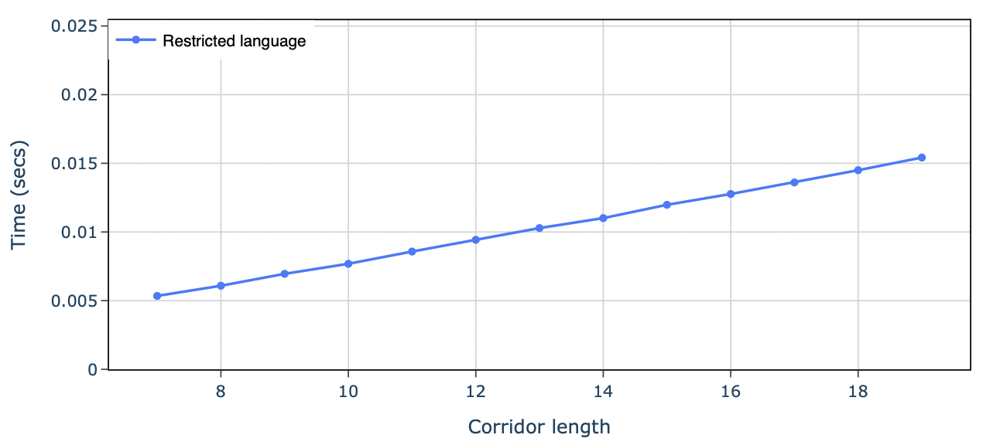
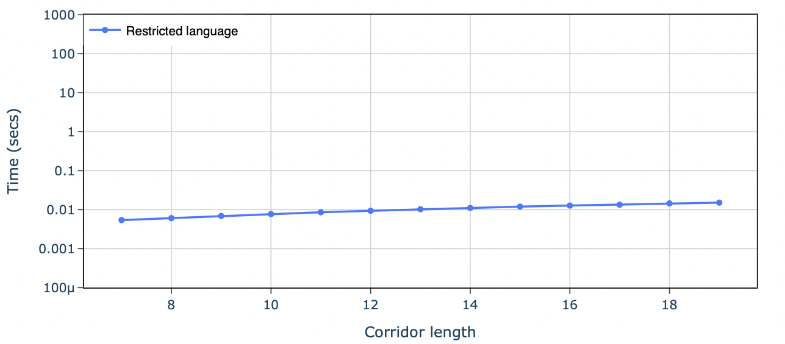

ADACT-L
========================
This repository contains the implementation of this [paper](https://openreview.net/forum?id=EW6bNEqalF&nesting=2&sort=date-desc). 

Setup:
```python 
#install requirements
pip install -r requirements.txt

```

**Usage:** <br>

Tmaze:

You can plot the time (in seconds) for increasing the T-maze corridor
length using the following script:
```python 
#implemntation of script found in tmaze.py
python tmaze.py [l_min] [l_max] -l

```
where `l_min` nad `l_max` are the minimum and maximum lengths of the 
corridor of the T-maze needed to be plotted. The last parameter
can be set to `-n` or `-l` to display a normal or logarithmic graph, respectively.




Other environments:
```python 
#implemntation of script found in run.py
python run.py [env name] H K threshold

```
where H, K, threshold are the horizon length, number of episodes, 
and threshold for the `TestDistinct()` function to return `False`, respectively. 


### Offline RL in Regular Decision Processes: Sample Efficiency via Language Metrics
_Ahana Deb, Roberto Cipollone, Anders Jonsson, Alessandro Ronca,
Mohammad Sadegh Talebi_ <br>

**Abstract** <br>

This work studies offline Reinforcement Learning (RL) in a class of non-Markovian environments
called Regular Decision Processes (RDPs). In RDPs, the unknown dependency of future observations and rewards from the past interactions can be captured by some hidden finite-state automaton. For this reason, many RDP algorithms first reconstruct this unknown dependency using automata learning techniques. In this paper, we consider episodic RDPs and show that it is possible to overcome the limitations of existing offline RL algorithms for RDPs via the introduction of two original techniques: a novel metric grounded in formal language theory and an approach based on Count-Min-Sketch (CMS). Owing to the novel language metric, our algorithm is proven to be more sample efficient than existing results, and in some problem instances admitting low complexity languages, the gain is showcased to be exponential in the episode length. 
The CMS-based approach removes the need for naïve counting and alleviates the memory requirements for long planning horizons. We derive Probably Approximately Correct (PAC) sample complexity bounds associated to each of these techniques, and validate the approach experimentally.


**Cite as:**

```commandline
@inproceedings{
deb2025offline,
title={Offline {RL} in Regular Decision Processes: Sample Efficiency via Language Metrics},
author={Ahana Deb and Roberto Cipollone and Anders Jonsson and Alessandro Ronca and Mohammad Sadegh Talebi},
booktitle={The Thirteenth International Conference on Learning Representations},
year={2025},
url={https://openreview.net/forum?id=EW6bNEqalF}
}
}
```
